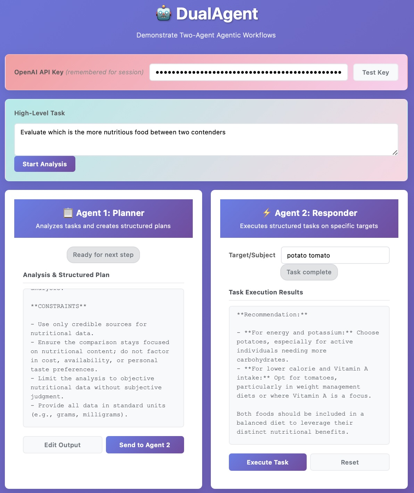

# 🤖 DualAgent

A clean, client-side web application that demonstrates the two-agent agentic workflow pattern. DualAgent helps users understand and experiment with the powerful pattern of **Agent 1 (Planner) → Agent 2 (Responder)**.



*Live demo showcasing the two-agent workflow interface*

## 🌟 Features

### Core Functionality
- **Client-side Only**: Fully functional in-browser, no backend required
- **Secure API Key Management**: OpenAI API key stored only in memory during session
- **Two-Agent Workflow**: Clear demonstration of Agent 1 → Agent 2 pattern
- **Interactive UI**: Clean, modern interface with real-time status updates
- **Example Templates**: Pre-built use cases to get started quickly

### Agent 1: Planner
- **Purpose**: Analyzes high-level tasks and creates structured plans
- **Function**: Breaks down complex goals into actionable frameworks
- **Output**: Detailed plan templates with criteria and constraints
- **UI**: Dedicated panel showing analysis and structured output

### Agent 2: Responder  
- **Purpose**: Executes structured tasks on specific targets
- **Function**: Uses Agent 1's framework to analyze specific subjects
- **Input**: Structured plan + user-specified target (e.g., company name)
- **UI**: Second panel showing execution results

### Stretch Goals Implemented
- ✅ **Edit Agent 1 Output**: Modify structured plans before sending to Agent 2
- ✅ **Example Templates**: Pre-built scenarios for startup evaluation, market research, legal analysis
- ✅ **Modular Design**: Clean architecture for easy extension to other domains
- ✅ **Minimal Dependencies**: Only OpenAI API and vanilla JavaScript

## 🚀 Quick Start

1. **Download Files**: Clone or download the repository
2. **Open in Browser**: Open `index.html` in any modern web browser
3. **Enter API Key**: Type your OpenAI API key - it's automatically remembered for the session
4. **Choose a Task**: Select an example template or enter your own high-level task
5. **Run Agent 1**: Click "Start Analysis" to generate structured plans
6. **Specify Target**: Enter a specific subject for Agent 2 to analyze
7. **Execute**: Watch Agent 2 use Agent 1's framework on your target

## 💡 Example Use Case: Startup Evaluation

### Step 1: High-Level Task
```
"Evaluate startups for investment potential"
```

### Step 2: Agent 1 (Planner) Output
Agent 1 analyzes this task and creates a structured evaluation framework:
- Team assessment criteria
- Traction metrics to examine
- Technology defensibility factors
- Market opportunity analysis
- Financial health indicators
- Risk assessment framework

### Step 3: Agent 2 (Responder) Execution
Agent 2 takes the framework and applies it to a specific startup:
```
Target: "OpenAI"
```
Result: Comprehensive analysis of OpenAI using the structured criteria from Agent 1.

## 🛠 Technical Architecture

### File Structure
```
dualagent/
├── index.html          # Main HTML structure
├── styles.css          # Modern, responsive styling
├── script.js           # Core JavaScript functionality
└── README.md           # This documentation
```

### Key Components

#### DualAgent Class
- **API Management**: Secure key storage and validation
- **Agent Orchestration**: Coordinates the two-agent workflow
- **UI State Management**: Handles button states and status updates
- **OpenAI Integration**: Direct API calls with error handling

#### Agent 1 (Planner)
```javascript
createAgent1Prompt(userTask) {
    // Creates structured analysis prompts
    // Breaks down high-level tasks
    // Defines criteria and constraints
}
```

#### Agent 2 (Responder)
```javascript
createAgent2Prompt(target) {
    // Uses Agent 1's structured output
    // Applies framework to specific target
    // Executes detailed analysis
}
```

## 🎯 Use Cases

### 1. Startup Evaluation
- **Agent 1**: Creates investment analysis framework
- **Agent 2**: Evaluates specific startups (OpenAI, RunwayML, etc.)

### 2. Market Research
- **Agent 1**: Structures market analysis approach
- **Agent 2**: Researches specific technologies or industries

### 3. Legal Analysis
- **Agent 1**: Defines compliance review framework
- **Agent 2**: Analyzes specific products or regulations

### 4. Academic Research
- **Agent 1**: Creates research methodology
- **Agent 2**: Applies to specific papers or topics

## 🔧 Customization

### Adding New Templates
Edit the example cards in `index.html`:
```html
<div class="example-card" data-task="Your custom task here">
    <h4>Custom Template</h4>
    <p>Description of your use case</p>
</div>
```

### Modifying Agent Prompts
Customize the prompt creation methods in `script.js`:
- `createAgent1Prompt()` - Modify how tasks are analyzed
- `createAgent2Prompt()` - Adjust how frameworks are applied

### Styling Changes
Update `styles.css` to match your preferred design:
- Color schemes
- Layout adjustments
- Responsive breakpoints

## 🔒 Security & Privacy

- **No Data Storage**: All data exists only during the browser session
- **API Key Security**: Keys stored only in memory, never persisted
- **Client-Side Only**: No backend servers or data transmission
- **HTTPS Required**: OpenAI API requires secure connections

## 🔄 Workflow Pattern Benefits

### Why Two Agents?

1. **Separation of Concerns**: 
   - Agent 1 focuses on analysis and structure
   - Agent 2 focuses on execution and results

2. **Reusability**:
   - One structured plan can analyze many targets
   - Efficient use of API calls and tokens

3. **Quality Control**:
   - Edit and refine Agent 1's output before execution
   - Consistent analysis framework across targets

4. **Scalability**:
   - Easy to add new domains and use cases
   - Modular design for different workflows

## 📋 Requirements

- Modern web browser (Chrome, Firefox, Safari, Edge)
- OpenAI API key
- Internet connection for API calls
- JavaScript enabled

## 🤝 Contributing

This is a demonstration project showcasing the dual-agent pattern. Feel free to:
- Fork and modify for your use cases
- Add new example templates
- Enhance the UI/UX
- Extend to other AI providers

## 📄 License

Open source - use and modify as needed for your projects.

---

**Built with vanilla JavaScript and OpenAI API • Client-side only • No data stored** 